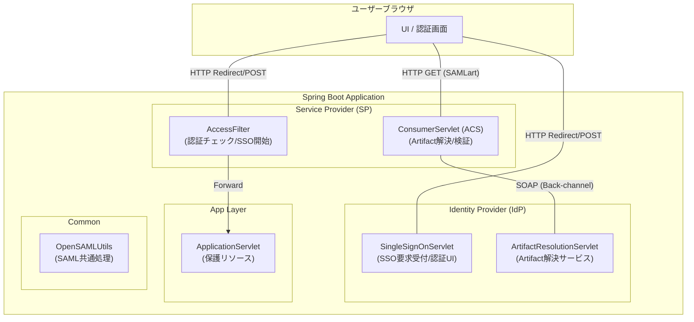
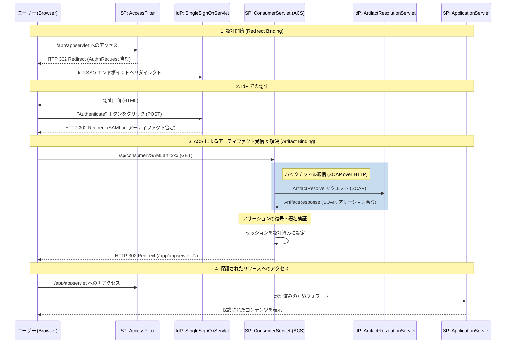

# OpenSAML5を使用したSPとIdPの連携デモ

このコードは、SAMLを使用してSPとIdPがどのように通信するかをシミュレートするものです。

このデモのバリエーションは、[A Guide to OpenSAML V2](https://payhip.com/b/odEY?utm_source=github&utm_medium=link&utm_campaign=opensaml_samples_collection&utm_content=getting-started-authn)および[A Guide to OpenSAML V3](https://payhip.com/b/41Tw?utm_source=github&utm_medium=link&utm_campaign=opensaml_samples_collection&utm_content=getting-started-authn)の書籍で広く使用されています。

このデモコードは、SP、IdP、およびビジネスアプリケーション上の異なるエンドポイントとして機能する複数のサーブレットを設定します。

このデモは、OpenSAMLの優れた概要ガイドとして機能し、以下を実証します：
## アーキテクチャと処理シーケンス

このセクションでは、本プロジェクトの構成と SAML Artifact Binding の詳細な処理フローを解説します。

### アーキテクチャ概要

本プロジェクトは、1つの Spring Boot アプリケーション内で **Service Provider (SP)** と **Identity Provider (IdP)** の両方の機能をシミュレートしています。

| レイヤー | コンポーネント | 役割 |
| :--- | :--- | :--- |
| **SP (Service Provider)** | `AccessFilter` | 全てのリクエストを保護し、未認証なら IdP へリダイレクトする。 |
| | `ConsumerServlet` | **Assertion Consumer Service (ACS)**。IdP からのアーティファクトを受信し、解決・検証を行う。 |
| **IdP (Identity Provider)** | `SingleSignOnServlet` | **SSO エンドポイント**。認証画面を表示し、成功後にアーティファクトを発行する。 |
| | `ArtifactResolutionServlet` | **Artifact Resolution Service**。SP からの SOAP リクエストを受け、アサーションを返す。 |
| **Common** | `OpenSAMLUtils` | OpenSAML オブジェクトの構築、シリアライズ、ログ出力などのユーティリティ。 |
| **App** | `ApplicationServlet` | 認証後にアクセス可能になる実際の「保護されたコンテンツ」。 |

### コンポーネント構成



### 処理シーケンス (SAML Artifact Binding)

以下は、ユーザーが保護されたリソースにアクセスしてから認証が完了するまでの流れです。



### 実装の詳細メモ

- **AuthnRequest**: `HTTPRedirectDeflateEncoder` を使用してエンコードされ、クエリパラメータとして送信されます。
- **Artifact**: `SAMLart` パラメータとして受け渡しされます。
- **Back-channel**: SP と IdP 間の通信（ArtifactResolve）はブラウザを経由しないバックチャネルで行われます。
- **Security**: メッセージは署名され、アサーションは暗号化されています。
* HTTP Redirectバインディングを使用したAuthnRequestの構築、署名、送信
* AuthnRequestの署名の解析と検証
* Artifactバインディングを使用したResponseメッセージの送信
* Assertionの暗号化と復号化

## コードのビルド

```bash
mvn clean package
```

## コードの実行

コードをクローンし、このサンプルのフォルダに移動して、次のコマンドを実行します：

以降のコマンドは、**backend**ディレクトリ配下で実行してください。

### Spring Boot で実行（推奨）

```bash
mvn spring-boot:run
```

または、JARファイルを直接実行：

```bash
java -jar target/opensaml5-webprofile-demo-1.0-SNAPSHOT.jar
```

その後、ブラウザを開いて http://127.0.0.1:8080/opensaml5-webprofile-demo/app/appservlet にアクセスしてください。

通信中に使用されるすべてのSAMLメッセージがコンソールにログ出力されます。

## 技術スタック

- **Java 21**
- **Spring Boot 3.3.0**
- **OpenSAML 5.1.6**
- **Jakarta EE 10**

## プロジェクト構成

```
src/main/java/no/steras/opensamlSamples/opensaml4WebprofileDemo/
├── Application.java              # Spring Boot 起動クラス
├── OpenSAMLUtils.java            # SAML ユーティリティ
├── config/
│   └── WebConfig.java            # Servlet/Filter 登録設定
├── app/
│   └── ApplicationServlet.java   # 保護リソース
├── idp/
│   ├── IDPConstants.java
│   ├── IDPCredentials.java
│   ├── SingleSignOnServlet.java  # SSO エンドポイント
│   └── ArtifactResolutionServlet.java
└── sp/
    ├── SPConstants.java
    ├── SPCredentials.java
    ├── AccessFilter.java         # 認証フィルター
    └── ConsumerServlet.java      # ACS エンドポイント
```

## エンドポイント

| パス | 説明 |
|------|------|
| `/app/appservlet` | 保護されたリソース（認証が必要） |
| `/idp/singleSignOnService` | IdP シングルサインオンエンドポイント |
| `/sp/consumer` | SP Assertion Consumer Service |
| `/idp/artifactResolutionService` | Artifact 解決エンドポイント |
| `/actuator/health` | ヘルスチェックエンドポイント |

## Docker で実行

### ローカルでビルド＆実行

以降のコマンドは、**backend**ディレクトリ配下で実行してください。

```bash
# アカウントIDとリージョンを環境変数化
export AWS_ACCOUNT_ID=$(aws sts get-caller-identity --query Account --output text)
export AWS_REGION=$(aws configure get region)
# ECR にログイン
aws ecr get-login-password --region $AWS_REGION | docker login --username AWS --password-stdin $AWS_ACCOUNT_ID.dkr.ecr.$AWS_REGION.amazonaws.com

# イメージをビルド(事前にECRにログインする必要あり)
docker build -t opensaml5-demo .

# コンテナを実行
docker run -p 8080:8080 opensaml5-demo
```

アクセス: http://localhost:8080/opensaml5-webprofile-demo/app/appservlet

### ヘルスチェック

```bash
curl http://localhost:8080/opensaml5-webprofile-demo/actuator/health
```

## AWS へのデプロイ (AWS CDKを活用)

**cdk**ディレクトリ配下で実行してください。

```bash
bun run deploy
```

BASE_URLを環境変数として埋め込みたいので以下のオプションをつけて2回目を実行する

```bash
bun run deploy -c baseUrl=https://xxxxx.execute-api.ap-northeast-1.amazonaws.com
```

### デプロイ後のヘルスチェック

```bash
curl <CdkStack.ApiEndpoint>/opensaml5-webprofile-demo/actuator/health
```

### アプリへのアクセス

<CdkStack.ApiEndpoint>/opensaml5-webprofile-demo/app/appservlets

## AWSのリソースデストロイ

```bash
bun run destroy --force
```


## 参考文献
- [DeepWiki](https://deepwiki.com/rasmusson/OpenSAML-sample-code)