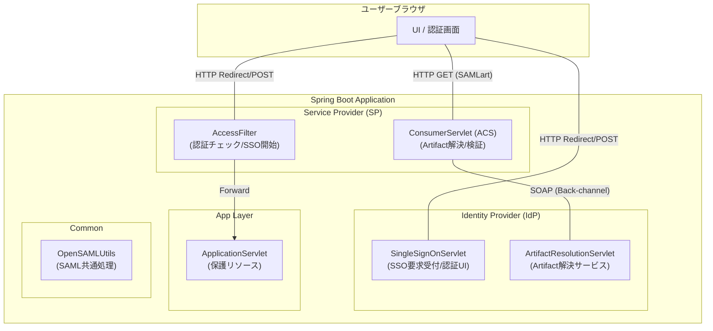
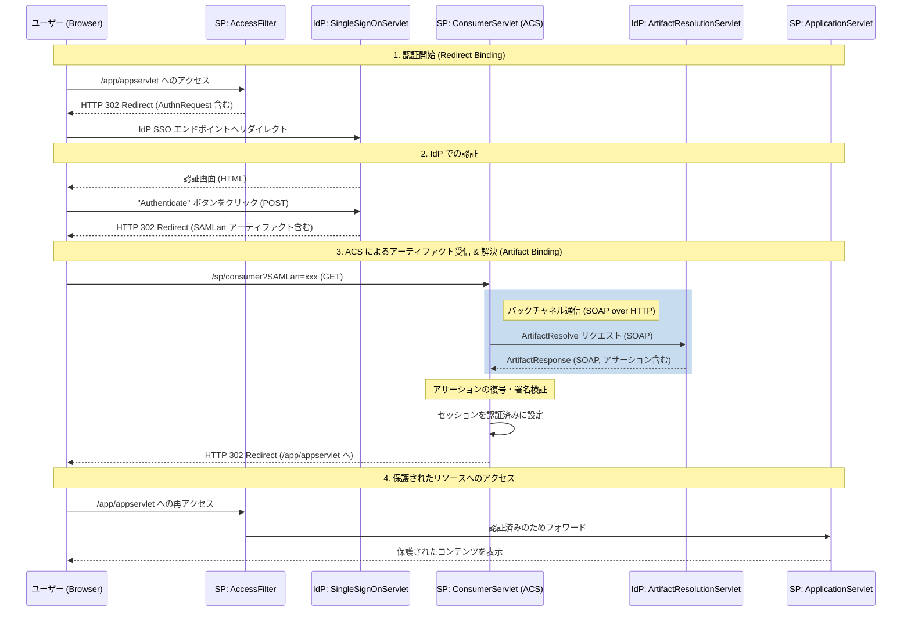

# OpenSAML5を使用したSPとIdPの連携デモ

このコードは、SAMLを使用してSPとIdPがどのように通信するかをシミュレートするものです。

このデモのバリエーションは、[A Guide to OpenSAML V2](https://payhip.com/b/odEY?utm_source=github&utm_medium=link&utm_campaign=opensaml_samples_collection&utm_content=getting-started-authn)および[A Guide to OpenSAML V3](https://payhip.com/b/41Tw?utm_source=github&utm_medium=link&utm_campaign=opensaml_samples_collection&utm_content=getting-started-authn)の書籍で広く使用されています。

このデモコードは、SP、IdP、およびビジネスアプリケーション上の異なるエンドポイントとして機能する複数のサーブレットを設定します。

このデモは、OpenSAMLの優れた概要ガイドとして機能し、以下を実証します：
## アーキテクチャと処理シーケンス

このセクションでは、本プロジェクトの構成と SAML Artifact Binding の詳細な処理フローを解説します。

### アーキテクチャ概要

本プロジェクトは、1つの Spring Boot アプリケーション内で **Service Provider (SP)** と **Identity Provider (IdP)** の両方の機能をシミュレートしています。

| レイヤー | コンポーネント | 役割 |
| :--- | :--- | :--- |
| **SP (Service Provider)** | `AccessFilter` | 全てのリクエストを保護し、未認証なら IdP へリダイレクトする。 |
| | `ConsumerServlet` | **Assertion Consumer Service (ACS)**。IdP からのアーティファクトを受信し、解決・検証を行う。 |
| **IdP (Identity Provider)** | `SingleSignOnServlet` | **SSO エンドポイント**。認証画面を表示し、成功後にアーティファクトを発行する。 |
| | `ArtifactResolutionServlet` | **Artifact Resolution Service**。SP からの SOAP リクエストを受け、アサーションを返す。 |
| **Common** | `OpenSAMLUtils` | OpenSAML オブジェクトの構築、シリアライズ、ログ出力などのユーティリティ。 |
| **App** | `ApplicationServlet` | 認証後にアクセス可能になる実際の「保護されたコンテンツ」。 |

### コンポーネント構成



### 処理シーケンス (SAML Artifact Binding)

以下は、ユーザーが保護されたリソースにアクセスしてから認証が完了するまでの流れです。



### 実装の詳細メモ

- **AuthnRequest**: `HTTPRedirectDeflateEncoder` を使用してエンコードされ、クエリパラメータとして送信されます。
- **Artifact**: `SAMLart` パラメータとして受け渡しされます。
- **Back-channel**: SP と IdP 間の通信（ArtifactResolve）はブラウザを経由しないバックチャネルで行われます。
- **Security**: メッセージは署名され、アサーションは暗号化されています。
* HTTP Redirectバインディングを使用したAuthnRequestの構築、署名、送信
* AuthnRequestの署名の解析と検証
* Artifactバインディングを使用したResponseメッセージの送信
* Assertionの暗号化と復号化

## コードのビルド

```bash
mvn clean package
```

## コードの実行

コードをクローンし、このサンプルのフォルダに移動して、次のコマンドを実行します：

以降のコマンドは、**backend**ディレクトリ配下で実行してください。

### Spring Boot で実行（推奨）

```bash
mvn spring-boot:run
```

または、JARファイルを直接実行：

```bash
java -jar target/opensaml5-webprofile-demo-1.0-SNAPSHOT.jar
```

その後、ブラウザを開いて http://127.0.0.1:8080/opensaml5-webprofile-demo/app/appservlet にアクセスしてください。

通信中に使用されるすべてのSAMLメッセージがコンソールにログ出力されます。

## 技術スタック

- **Java 21**
- **Spring Boot 3.3.0**
- **OpenSAML 5.1.6**
- **Jakarta EE 10**

## プロジェクト構成

```
src/main/java/no/steras/opensamlSamples/opensaml4WebprofileDemo/
├── Application.java              # Spring Boot 起動クラス
├── OpenSAMLUtils.java            # SAML ユーティリティ
├── config/
│   └── WebConfig.java            # Servlet/Filter 登録設定
├── app/
│   └── ApplicationServlet.java   # 保護リソース
├── idp/
│   ├── IDPConstants.java
│   ├── IDPCredentials.java
│   ├── SingleSignOnServlet.java  # SSO エンドポイント
│   └── ArtifactResolutionServlet.java
└── sp/
    ├── SPConstants.java
    ├── SPCredentials.java
    ├── AccessFilter.java         # 認証フィルター
    └── ConsumerServlet.java      # ACS エンドポイント
```

## エンドポイント

| パス | 説明 |
|------|------|
| `/app/appservlet` | 保護されたリソース（認証が必要） |
| `/idp/singleSignOnService` | IdP シングルサインオンエンドポイント |
| `/sp/consumer` | SP Assertion Consumer Service |
| `/idp/artifactResolutionService` | Artifact 解決エンドポイント |
| `/actuator/health` | ヘルスチェックエンドポイント |

## Docker で実行

### ローカルでビルド＆実行

以降のコマンドは、**backend**ディレクトリ配下で実行してください。

```bash
# アカウントIDとリージョンを環境変数化
export AWS_ACCOUNT_ID=$(aws sts get-caller-identity --query Account --output text)
export AWS_REGION=$(aws configure get region)
# ECR にログイン
aws ecr get-login-password --region $AWS_REGION | docker login --username AWS --password-stdin $AWS_ACCOUNT_ID.dkr.ecr.$AWS_REGION.amazonaws.com

# イメージをビルド(事前にECRにログインする必要あり)
docker build -t opensaml5-demo .

# コンテナを実行
docker run -p 8080:8080 opensaml5-demo
```

アクセス: http://localhost:8080/opensaml5-webprofile-demo/app/appservlet

### ヘルスチェック

```bash
curl http://localhost:8080/opensaml5-webprofile-demo/actuator/health
```

## AWS へのデプロイ (AWS CDKを活用)

**cdk**ディレクトリ配下で実行してください。

```bash
bun run deploy
```

BASE_URLを環境変数として埋め込みたいので以下のオプションをつけて2回目を実行する

```bash
bun run deploy -c baseUrl=https://xxxxx.execute-api.ap-northeast-1.amazonaws.com
```

### デプロイ後のヘルスチェック

```bash
curl <CdkStack.ApiEndpoint>/opensaml5-webprofile-demo/actuator/health
```

### アプリへのアクセス

<CdkStack.ApiEndpoint>/opensaml5-webprofile-demo/app/appservlets

## AWSのリソースデストロイ

```bash
bun run destroy --force
```


## SAML用語集 (SAML Glossary)

SAML認証に関連する主要な用語の解説です。本プロジェクトの実装を理解するための参考にしてください。

| 用語 | 説明 |
| :--- | :--- |
| **Entity ID** | SPやIdPを一意に識別するためのURL形式の識別子。 |
| **Service Provider (SP)** | SAML認証を利用してサービスを提供する側のシステム（このアプリの `AccessFilter` や `ConsumerServlet`）。 |
| **Identity Provider (IdP)** | ユーザーの認証を行い、認証結果（アサーション）を発行する側のシステム（このアプリの `SingleSignOnServlet` や `ArtifactResolutionServlet`）。 |
| **Assertion (アサーション)** | ユーザーの認証成功事実や属性情報（名前、メールアドレス等）が含まれたXMLデータ。 |
| **AuthnRequest** | SPがIdPに対して「このユーザーを認証してほしい」と要求する際に送るリクエストメッセージ。 |
| **Response** | IdPが認証結果をSPに返すためのメッセージ。成功時にはアサーションが含まれる。 |
| **Protocol Binding** | SAMLメッセージをどのように伝送するかを定義する方式。以下の HTTP Redirect, POST, Artifact などの種類がある。 |
| **HTTP Redirect Binding** | メッセージをURLのクエリパラメータとして送信する方式（GET）。データは圧縮・エンコードされるため、AuthnRequestなどの小規模な通信に利用される。 |
| **HTTP POST Binding** | メッセージをHTMLフォームの隠しフィールドとして送信する方式（POST）。大容量のデータ（Assertionを含むResponseなど）を送信でき、ブラウザのURL履歴にメッセージが残らない。 |
| **Artifact Binding** | 本体メッセージの代わりに一時的な「引換券（アーティファクト）」をブラウザ経由で送る方式。本体はサーバー間で直接交換（バックチャネル）するため、最も安全性が高い。 |
| **SAML Artifact** | SAMLレスポンスの代わりに使用される、一時的な「引換券（チケット）」。有効期限が非常に短く、一度の交換で無効化される。 |
| **Artifact Resolve** | SPが受け取ったアーティファクト（引換券）を、本物のSAMLレスポンスと交換するためにIdPへ送るリクエスト。 |
| **ACS (Assertion Consumer Service)** | SP側でSAMLレスポンス（またはアーティファクト）を受け取るためのエンドポイント（このアプリの `ConsumerServlet`）。 |
| **Metadata** | SPとIdPの間で信頼関係を築くために交換する設定情報。エンドポイントURLや公開鍵証明書などが含まれる。 |
| **Front-channel** | ユーザーのブラウザを介した通信。リダイレクトやフォームPOSTなど、ユーザーの目に触れる経路。 |
| **Back-channel** | サーバー間で直接行われる通信（このアプリのArtifactResolveなど）。ユーザーのブラウザを介さないため安全。 |

## SAMLメッセージの構造 (SAML Message Structures)

SAMLでやり取りされるXMLメッセージの主要な構造と、各要素の意味を解説します。

### 1. SAML Metadata
SPとIdPが互いの設定を共有するためのXMLファイルです。

- `<EntityDescriptor>`: メタデータのルート要素。`entityID`属性でシステムを識別します。
- `<SPSSODescriptor>` / `<IDPSSODescriptor>`: SP(サービスプロバイダー)またはIdP(認証プロバイダー)としての機能定義。
- `<KeyDescriptor>`: 署名検証や暗号化に使用する公開鍵証明書 (`X509Certificate`) が含まれます。
- `<SingleSignOnService>` (IdP用): SPが認証リクエストを送る先のエンドポイント。
- `<AssertionConsumerService>` (SP用): IdPが認証レスポンスを返す先のエンドポイント。

**例 (SPメタデータの一部):**
```xml
<md:EntityDescriptor 
    entityID="TestSP"  <!-- SPを一意に識別するID -->
    xmlns:md="urn:oasis:names:tc:SAML:2.0:metadata"
>
    <!-- SPとしての設定定義 -->
    <md:SPSSODescriptor protocolSupportEnumeration="urn:oasis:names:tc:SAML:2.0:protocol">
        <!-- 署名に使用する公開鍵情報 -->
        <md:KeyDescriptor use="signing">
            <ds:KeyInfo xmlns:ds="http://www.w3.org/2000/09/xmldsig#">
                <ds:X509Data>
                    <ds:X509Certificate>
                        MIIDDTCCAfWgAw... <!-- 公開鍵証明書本体 -->
                    </ds:X509Certificate>
                </ds:X509Data>
            </ds:KeyInfo>
        </md:KeyDescriptor>
        <!-- IdPからのレスポンス(アーティファクト)を受け取るURL -->
        <md:AssertionConsumerService 
            Binding="urn:oasis:names:tc:SAML:2.0:bindings:HTTP-Artifact" 
            Location="http://localhost:8080/opensaml5-webprofile-demo/sp/consumer" index="1"/>
    </md:SPSSODescriptor>
</md:EntityDescriptor>
```

### 2. AuthnRequest (SAMLリクエスト)
SPが認証を要求する際に生成するXMLです。

- `<saml2p:AuthnRequest>`: ルート要素。`ID`、`IssueInstant`（発行時刻）、`Destination`（送信先）などの属性を持ちます。
- `<saml2:Issuer>`: リクエストを発行したSPのEntity ID。
- `<saml2p:NameIDPolicy>`: 要求するユーザー識別子（NameID）の形式。本アプリでは一時的なIDである `Transient` を指定しています。
- `<saml2p:RequestedAuthnContext>`: 要求する認証レベル。本アプリではパスワード認証 (`Password`) を最低条件として指定しています。

**例:**
```xml
<saml2p:AuthnRequest 
    xmlns:saml2p="urn:oasis:names:tc:SAML:2.0:protocol" 
    ID="_a1b2c3d4e5f6..." <!-- リクエストの一意なID -->
    IssueInstant="2024-01-01T00:00:00Z" <!-- 作成日時 -->
    Version="2.0"
    Destination="http://localhost:8080/opensaml5-webprofile-demo/idp/singleSignOnService" <!-- 送信先(IdP) -->
    ProtocolBinding="urn:oasis:names:tc:SAML:2.0:bindings:HTTP-Artifact" <!-- 応答にArtifactを要求 -->
    AssertionConsumerServiceURL="http://localhost:8080/opensaml5-webprofile-demo/sp/consumer"> <!-- 戻り先URL -->
    <saml2:Issuer xmlns:saml2="urn:oasis:names:tc:SAML:2.0:assertion">
        TestSP <!-- 発行元のSP名 -->
    </saml2:Issuer>
    <!-- ユーザー識別子(NameID)のポリシー設定 -->
    <saml2p:NameIDPolicy 
        AllowCreate="true" 
        Format="urn:oasis:names:tc:SAML:2.0:nameid-format:transient"
    />
    <!-- 要求する認証コンテキスト(認証方法) -->
    <saml2p:RequestedAuthnContext Comparison="minimum">
        <saml2:AuthnContextClassRef xmlns:saml2="urn:oasis:names:tc:SAML:2.0:assertion">
            urn:oasis:names:tc:SAML:2.0:ac:classes:Password <!-- パスワード認証を要求 -->
        </saml2:AuthnContextClassRef>
    </saml2p:RequestedAuthnContext>
</saml2p:AuthnRequest>
```

### 3. SAML Response & Assertion (SAMLレスポンス)
IdPが認証結果を伝えるためのXMLです。

- `<saml2p:Response>`: レスポンス全体のルート。
- `<saml2p:Status>`: 認証の成否。`<saml2p:StatusCode Value="...Success">` であれば成功です。
- `<saml2:Assertion>`: **最重要要素。** 認証されたユーザーに関する「主張（Assertion）」が含まれます。
    - `<saml2:Subject>`: 誰が認証されたかを表す `NameID`。
    - `<saml2:Conditions>`: アサーションの有効期限（`NotBefore`, `NotOnOrAfter`）。
    - `<saml2:AuthnStatement>`: 認証が行われた時刻や方法。
    - `<saml2:AttributeStatement>`: ユーザーの属性情報（氏名、メールアドレス、ロールなど）。
- `<ds:Signature>`: メッセージやアサーションが正当な送信者から送られ、改ざんされていないことを証明するデジタル署名。

**例:**
```xml
<saml2p:Response 
    xmlns:saml2p="urn:oasis:names:tc:SAML:2.0:protocol" 
    ID="_f0e9d8c7..." 
    InResponseTo="_a1b2c3d4..." <!-- どのリクエストへの応答か -->
    IssueInstant="2024-01-01T00:00:05Z" 
    Version="2.0"
    Destination="http://localhost:8080/opensaml5-webprofile-demo/sp/consumer"
>
    <!-- 発行者(IdP)の情報 -->
    <saml2:Issuer xmlns:saml2="urn:oasis:names:tc:SAML:2.0:assertion">
        TestIDP
    </saml2:Issuer>
    <!-- ステータスコード(成功/失敗) -->
    <saml2p:Status>
        <saml2p:StatusCode Value="urn:oasis:names:tc:SAML:2.0:status:Success"/>
    </saml2p:Status>
    <!-- アサーション本体 -->
    <saml2:Assertion 
        xmlns:saml2="urn:oasis:names:tc:SAML:2.0:assertion" 
        ID="_m0n9b8v7..." 
        IssueInstant="2024-01-01T00:00:05Z" 
        Version="2.0"
    >
        <saml2:Issuer>TestIDP</saml2:Issuer>
        <!-- 認証されたユーザー情報 -->
        <saml2:Subject>
            <saml2:NameID Format="urn:oasis:names:tc:SAML:2.0:nameid-format:transient">
                user-123 <!-- ユーザーID(一時ID) -->
            </saml2:NameID>
        </saml2:Subject>
        <!-- 認証に関する詳細(時刻・方法など) -->
        <saml2:AuthnStatement AuthnInstant="2024-01-01T00:00:05Z">
            <saml2:AuthnContext>
                <saml2:AuthnContextClassRef>
                    urn:oasis:names:tc:SAML:2.0:ac:classes:Password
                </saml2:AuthnContextClassRef>
            </saml2:AuthnContext>
        </saml2:AuthnStatement>
        <!-- ユーザーの属性情報 -->
        <saml2:AttributeStatement>
            <saml2:Attribute Name="email">
                <saml2:AttributeValue>
                    user@example.com
                </saml2:AttributeValue>
            </saml2:Attribute>
        </saml2:AttributeStatement>
    </saml2:Assertion>
</saml2p:Response>
```

### 4. メタデータの自動交換 (Metadata Auto-Exchange)

運用環境では、メタデータをファイルとして手動で交換する代わりに、HTTPエンドポイントを介して動的に取得・更新する仕組みが一般的に利用されます。

- **利点**:
    - **証明書更新の自動化**: 証明書が更新された際、各システムが自動的に新しいメタデータを取得するため、手動の作業ミスを防げます。
    - **スケーラビリティ**: 連携先が増えた場合でも、URLを登録するだけで管理が可能になります。

- **OpenSAML 5 での実装イメージ**:
    OpenSAMLでは `HTTPMetadataResolver` を使用して、リモートのURLから定期的にメタデータをフェッチできます。

  ```java
  // 1. HTTPMetadataResolverの構築
  HTTPMetadataResolver metadataResolver = new HTTPMetadataResolver(
      httpClient, "http://idp.example.com/metadata"
  );
  
  // 2. キャッシュとリフレッシュ周期の設定
  metadataResolver.setMinRefreshDelay(Duration.ofMinutes(5));
  metadataResolver.setMaxRefreshDelay(Duration.ofHours(1));
  
  // 3. セキュリティ：メタデータ自体の署名検証
  SignatureValidationFilter sigFilter = new SignatureValidationFilter(
      new ExplicitKeySignatureTrustEngine(keyResolver, sigTrustEngine),
      new SAMLSignatureProfileValidator()
  );
  metadataResolver.setMetadataFilter(sigFilter);
  
  // 4. 初期化
  metadataResolver.initialize();
  ```

---

## 参考文献
- [DeepWiki](https://deepwiki.com/rasmusson/OpenSAML-sample-code)