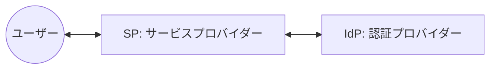
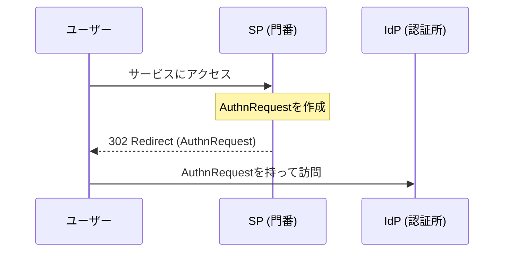
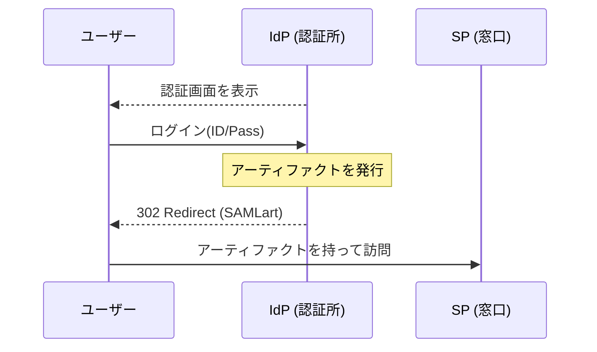
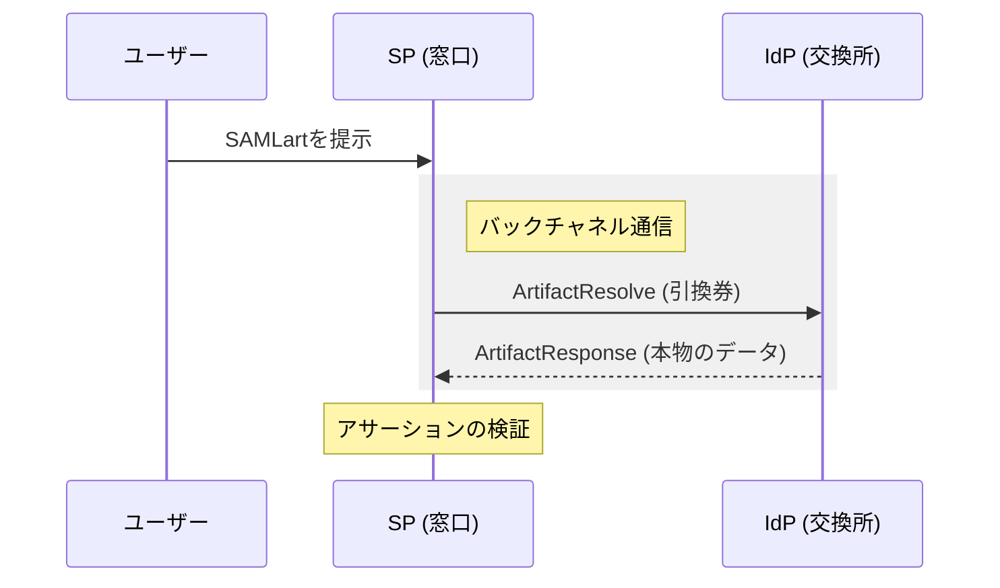
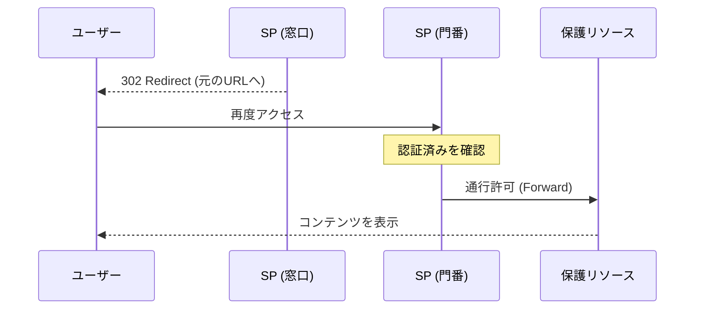

# 読めばわかるSAML 2.0！OpenSAML 5で学ぶSP・IdP連携の完全ガイド

SAML（Security Assertion Markup Language）と聞いて、「なんだか難しそう...」「XMLが複雑で近寄りがたい...」と感じたことはありませんか？

多くの開発者にとって、SAMLは「一度設定すれば触りたくないブラックボックス」になりがちです。しかし、中身を紐解いてみると、そこには「信頼を繋ぐための洗練されたストーリー」があります。

この記事では、OpenSAML 5を使用したサンプルプロジェクトを題材に、SAML 2.0の世界をストーリー形式で、かつ技術的に深く解説していきます。

---

## 1. 登場人物の紹介：1つのアプリ、2つの顔

SAMLの世界には、主に2つの重要な役割が登場します。今回のサンプルプロジェクトでは、1つの Spring Boot アプリケーションの中にこの両方が同居しています。

- **Service Provider (SP)**: ユーザーが使いたい「サービス」を提供する側。
- **Identity Provider (IdP)**: ユーザーの「本人確認」を担当する側。



今回のコードでは、以下のコンポーネントがこれらの役割を演じています。

| コンポーネント | 役割 | 実際のクラス名 |
| :--- | :--- | :--- |
| **SPの門番** | 未認証ユーザーを捕まえ、IdPへ案内する | `AccessFilter` |
| **SPの窓口** | IdPからの証拠（アーティファクト）を受け取る | `ConsumerServlet` |
| **IdPの認証所** | ユーザーを確認し、引換券を発行する | `SingleSignOnServlet` |
| **IdPの交換所** | 引換券を本物のデータ（アサーション）と交換する | `ArtifactResolutionServlet` |

---

## 2. 実況！SAML Artifact Binding のストーリー

ユーザーが「保護されたページ」にアクセスしてから、認証が完了するまでを追いかけてみましょう。今回はセキュリティレベルの高い **Artifact Binding** という方式を採用しています。

### Scene 1: 「まずは認証を！」 (AuthnRequest)
ユーザーがSP（サービス）にアクセスしようとすると、門番（`AccessFilter`）が立ちはだかります。「未認証ですね。IdPさんで認証してきてください！」

ここでSPは **AuthnRequest（SAMLリクエスト）** を作成します。これは「この人を認証してください」というお願い状です。



### Scene 2: 「引換券（アーティファクト）をどうぞ」
ユーザーはIdPにリダイレクトされます。IdPでログインに成功すると、IdPは「本人確認完了！」となりますが、ここで**本物のデータは渡しません。**

代わりに IdP は、**SAMLアーティファクト（引換券）** というランダムな文字列をユーザーに持たせて、SPの窓口（`ConsumerServlet`）に返します。



### Scene 3: 「裏側で本物と交換」 (Artifact Resolve)
SPの窓口にユーザーがやってきました。「IdPさんから引換券をもらってきました！」

SPは、ユーザーからは見えない「裏側の通信（バックチャネル）」でIdPに問い合わせます。「この引換券に対応する本物のデータをください（ArtifactResolve）」。

IdPは「間違いありません」と、本物のユーザーデータが含まれた **Assertion（アサーション）** を返します。



### Scene 4: 「通行許可！」
SPはデータを確認し、セッションを「認証済み」に更新。ユーザーはようやく見たいページに辿り着けます。めでたしめでたし。



---

## 3. これだけは押さえたい！SAML用語集

| 用語 | 説明 |
| :--- | :--- |
| **Assertion (アサーション)** | 「このユーザーは誰で、どの権限を持っている」という事実を証明するXMLデータ。 |
| **AuthnRequest** | SPからIdPへの「認証して！」という依頼。 |
| **Entity ID** | システムごとのユニークな名前（住所のようなもの）。 |
| **Protocol Binding** | データの運び方。`HTTP Redirect`（URLに載せる）、`HTTP POST`（フォームで送る）、`Artifact`（引換券方式）などがある。 |
| **Front-channel / Back-channel** | ユーザーのブラウザを通るのが「フロント」、サーバー同士が直接話すのが「バック」。 |

---

## 4. XMLの中身を覗いてみよう（Deep Dive）

SAMLの正体はXMLです。具体的なデータ例を見ていきましょう。

### 認証リクエスト (AuthnRequest)
SPがIdPに送る最初のお願い状です。

```xml
<saml2p:AuthnRequest 
    ID="_a1b2c3d..." <!-- リクエストの通し番号 -->
    IssueInstant="2024-01-01T00:00:00Z"
    Destination="http://idp.example.com/sso" <!-- 送信先URL -->
    ProtocolBinding="urn:oasis:names:tc:SAML:2.0:bindings:HTTP-Artifact"
>
    <saml2:Issuer>TestSP</saml2:Issuer> <!-- 私(SP)はTestSPです -->
</saml2p:AuthnRequest>
```

### 認証レスポンス (Response & Assertion)
IdPがSPに返す、最も重要なデータです。

```xml
<saml2p:Response ...>
    <saml2p:Status>
        <saml2p:StatusCode Value="...Success"/> <!-- 認証成功！ -->
    </saml2p:Status>
    <saml2:Assertion ...>
        <saml2:Subject>
            <saml2:NameID>user-123</saml2:NameID> <!-- ユーザーはuser-123です -->
        </saml2:Subject>
        <saml2:AttributeStatement>
            <saml2:Attribute Name="email">
                <saml2:AttributeValue>user@example.com</saml2:AttributeValue>
            </saml2:Attribute>
        </saml2:AttributeStatement>
    </saml2:Assertion>
</saml2p:Response>
```

---

## 5. 実装深掘り：OpenSAML 5 による具体的なコード解説

ただの概念理解で終わらせないのが技術ブログ！実際の Java コードで、OpenSAML 5 がどのように魔法をかけているのかを見ていきましょう。

### ① 門番：AuthnRequest の生成と送信 (`AccessFilter`)

ユーザーを IdP へ送り出すための「お願い状」を作るコードです。

```java
private AuthnRequest buildAuthnRequest() {
    // OpenSAMLのビルダーを使用してオブジェクトを生成
    AuthnRequest authnRequest = OpenSAMLUtils.buildSAMLObject(AuthnRequest.class);
    
    authnRequest.setIssueInstant(Instant.now()); // 発行時刻
    authnRequest.setDestination(getIPDSSODestination()); // 送信先(IdP)のURL
    authnRequest.setID(OpenSAMLUtils.generateSecureRandomId()); // 一意なID
    
    // どのバインディング（今回はArtifact）で結果を返してほしいかを指定
    authnRequest.setProtocolBinding(SAMLConstants.SAML2_ARTIFACT_BINDING_URI);
    authnRequest.setAssertionConsumerServiceURL(getAssertionConsumerEndpoint());

    return authnRequest;
}
```

このリクエストを URL パラメータに載せるために `HTTPRedirectDeflateEncoder` を使って、圧縮・エンコード・署名を行っています。

### ② 窓口：アーティファクト解決 (`ConsumerServlet`)

ブラウザから届いた「引換券（アーティファクト）」を IdP へ持っていき、本物のデータ（アサーション）と交換するバックチャネル通信の実装です。

```java
// SOAPクライアントを使用してIdPと裏側で通信
AbstractPipelineHttpSOAPClient soapClient = new AbstractPipelineHttpSOAPClient() {
    protected HttpClientMessagePipeline newPipeline() throws SOAPException {
        HttpClientRequestSOAP11Encoder encoder = new HttpClientRequestSOAP11Encoder();
        HttpClientResponseSOAP11Decoder decoder = new HttpClientResponseSOAP11Decoder();
        
        // 送信時に署名を付与するためのハンドラーを追加
        SAMLOutboundProtocolMessageSigningHandler signingHandler = new SAMLOutboundProtocolMessageSigningHandler();
        signingHandler.initialize();
        
        BasicHttpClientMessagePipeline pipeline = new BasicHttpClientMessagePipeline(encoder, decoder);
        pipeline.setOutboundPayloadHandler(signingHandler);
        return pipeline;
    }
};

// ArtifactResolutionService エンドポイントへ送信
soapClient.send(IDPConstants.ARTIFACT_RESOLUTION_SERVICE, context);

// IdPから返ってきた本物のレスポンスを取得
ArtifactResponse artifactResponse = (ArtifactResponse) context.getInboundMessageContext().getMessage();
```

### ③ アサーションの検証と復号 (`ConsumerServlet`)

受け取ったデータの「正しさ」を確認する、セキュリティの要です。

```java
// 1. デジタル署名の検証（改ざんされていないか？）
SAMLSignatureProfileValidator profileValidator = new SAMLSignatureProfileValidator();
profileValidator.validate(assertion.getSignature());
SignatureValidator.validate(assertion.getSignature(), IDPCredentials.getCredential());

// 2. 暗号化されているアサーションを復号
Decrypter decrypter = new Decrypter(null, keyInfoCredentialResolver, new InlineEncryptedKeyResolver());
Assertion decryptedAssertion = decrypter.decrypt(encryptedAssertion);
```

このように、OpenSAML は複雑な XML 操作や暗号化処理を、直感的なオブジェクト指向のコードで扱えるようにしてくれます。

---

## 6. おまけ：コードに出てきた OpenSAML の重要メソッド解説

コードを読み解く鍵となる 4 つの重要メソッドについて、その仕様を詳しく見ていきましょう。

### ① `OpenSAMLUtils.buildSAMLObject(Class<T> clazz)`
- **引数**: 生成したい SAML オブジェクトのクラス（例: `AuthnRequest.class`）
- **戻り値**: 指定したクラスのインスタンス（`XMLObject`）
- **役割**: SAML オブジェクトを生成するための汎用ファクトリメソッド。
- **解説**: SAML の XML は構造が複雑なため、OpenSAML では各要素に対応する「ビルダー」が存在します。このメソッドは内部で適切なビルダーを自動選択し、正しい名前空間（XML Namespace）を持つオブジェクトをインスタンス化してくれます。

### ② `signingHandler.initialize()`
- **引数**: なし
- **戻り値**: なし（例外: `ComponentInitializationException`）
- **役割**: コンポーネントを使用可能な状態に確定（フリーズ）させる。
- **解説**: OpenSAML や Shibboleth のコンポーネントは「構築 → 設定 → 初期化」というライフサイクルを持ちます。`initialize()` を呼ぶことで設定が読み取り専用になり、実際の処理（署名の付与など）が実行可能になります。これを忘れると実行時にエラーになります。

### ③ `profileValidator.validate(Signature signature)`
- **引数**: 検証対象の `Signature`（署名）オブジェクト
- **戻り値**: なし（例外: `SignatureException`）
- **役割**: 署名が「SAML の標準ルール（プロファイル）」に従っているかチェックする。
- **解説**: 実際に数学的な計算（公開鍵での検証）を行う前に、署名の構造が正しいか、禁止されているアルゴリズムが使われていないかなど、SAML 仕様としての妥当性を確認します。

### ④ `SignatureValidator.validate(Signature signature, Credential credential)`
- **引数**: `Signature` オブジェクトと、検証に使用する公開鍵を含む `Credential`
- **戻り値**: なし（例外: `SignatureException`）
- **役割**: 実際にデジタル署名の「数学的な正当性」を検証する。
- **解説**: 指定された公開鍵を使用して、送られてきたメッセージのハッシュ値と署名が一致するかを計算します。これが成功すれば、「メッセージは改ざんされておらず、本物の相手から送られてきたもの」であることが証明されます。

---

## まとめ：SAMLは「信頼のバトン」

いかがでしたでしょうか？一見複雑に見えるSAMLですが、**「お願いをする」「証拠をもらう」「裏で確認する」** という一連の流れがルール化されているだけなのです。

今回紹介した **Artifact Binding** は、ブラウザに直接機密データを流さないため、エンタープライズ領域で非常に重要な技術です。この記事が、あなたのSAMLアレルギーを克服する一歩になれば幸いです！

**Happy Coding!**

---
*この記事は、[OpenSAML-sample-code](https://github.com/mashharuki/OpenSAML-sample-code) をベースに作成されました。*
