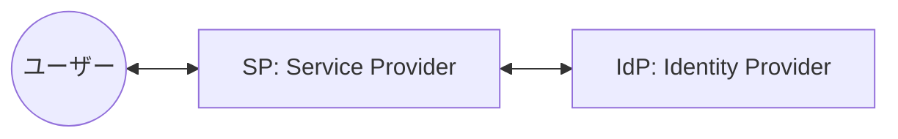
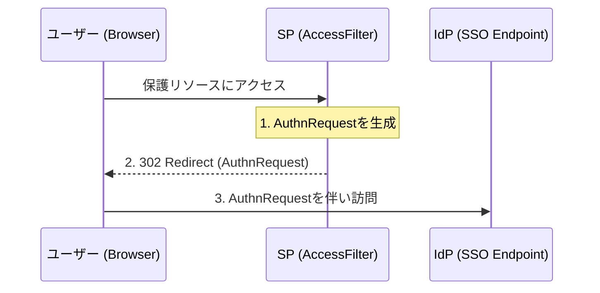
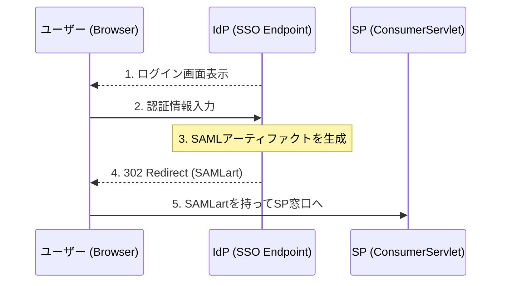
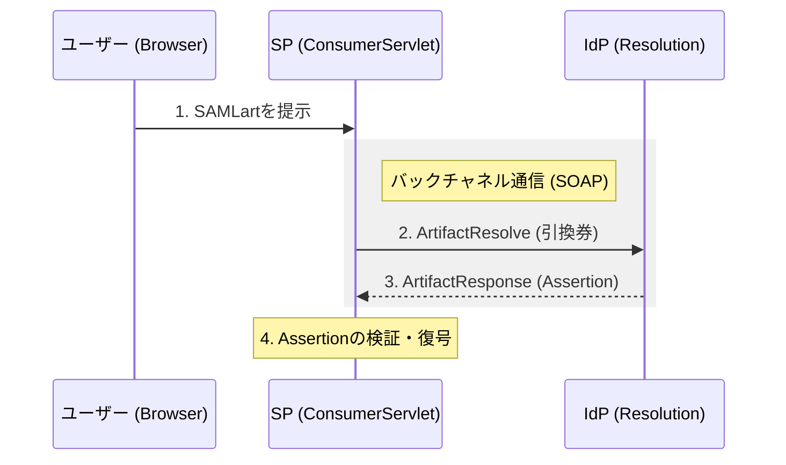

# OpenSAML 5で実装するSAML 2.0 Artifact Binding - SP/IdP連携の仕組みと実装ガイド

SAML（Security Assertion Markup Language）は、エンタープライズ領域のシングルサインオン（SSO）において欠かせない技術です。しかし、その仕様の複雑さから「中身がよくわからないブラックボックス」として扱われることも少なくありません。

この記事では、Javaの標準的なライブラリである **OpenSAML 5** を使用したサンプルプロジェクトを題材に、特にセキュリティレベルの高い **Artifact Binding** の仕組みと実装方法を詳しく解説します。

---

## この記事の対象読者
- Spring Bootでの開発経験がある方
- 認証・認可の基礎知識（Cookie/Sessionなど）がある方
- SAMLの概要は知っているが、具体的な実装やメッセージフローを理解したい方

---

## 1. 登場人物と役割の整理

SAML連携において、システムは以下の2つの役割のいずれか（あるいは両方）を演じます。

| 役割 | 略称 | 説明 | 本プロジェクトでの実装例 |
| :--- | :--- | :--- | :--- |
| **Service Provider** | **SP** | サービスを提供する側。ユーザーの認証状態を管理する。 | `AccessFilter`, `ConsumerServlet` |
| **Identity Provider** | **IdP** | 本人確認を行う側。ユーザー情報を管理し、証明書を発行する。 | `SingleSignOnServlet`, `ArtifactResolutionServlet` |



---

## 2. SAML Artifact Binding の詳細シーケンス

SAMLには複数の運び方（Binding）がありますが、今回はブラウザ経由で機密情報を直接流さない **Artifact Binding** を採用したフローを追います。

### Scene 1: 認証リクエストの送出 (AuthnRequest)
未認証のユーザーがSPの保護リソースにアクセスすると、SPの門番（`AccessFilter`）が **AuthnRequest** を生成し、ユーザーをIdPへリダイレクトさせます。



### Scene 2: 認証とアーティファクトの発行
IdPはユーザーを認証（ログイン）させた後、情報の「引換券」である **SAMLアーティファクト** を発行します。本物のデータ（Assertion）はこの時点ではユーザーに渡されません。



### Scene 3: バックチャネルによる情報交換 (Artifact Resolve)
SPの窓口（`ConsumerServlet`）は受け取ったアーティファクトを使い、サーバー間通信（バックチャネル）でIdPに本物のデータを問い合わせます。



#### なぜ Artifact Binding なのか？（セキュリティの観点）
Artifact Binding が他の方式（HTTP POST Bindingなど）より優れている点は以下の通りです。
- **機密性の向上**: ユーザー情報を保持する `Assertion` がユーザーのブラウザを通過しません。これにより、ブラウザの履歴やキャッシュから機密情報が漏洩するリスクを低減します。
- **リプレイ攻撃への耐性**: アーティファクトは一度きりの使い捨てであり、短時間で有効期限が切れるように設計されています。
- **サイズ制限の回避**: HTTP RedirectではURLの長さに制限がありますが、バックチャネル通信であれば大きなデータも安全に送受信できます。

### Scene 4: 認証完了とセッション確立
SPは取得した情報を検証し、正当であればアプリケーション内でのログイン状態（Session）を確立します。その後、ユーザーを本来の目的地へ転送します。

---

## 3. 実装深掘り：OpenSAML 5 によるコード解説

主要なコンポーネントにおける実装のポイントを、例外処理を含めて見ていきましょう。

### ① AuthnRequest の生成
**クラス**: `no.steras.opensamlSamples.opensaml4WebprofileDemo.sp.AccessFilter`  
**メソッド**: `buildAuthnRequest()`

```java
private AuthnRequest buildAuthnRequest() {
    AuthnRequest authnRequest = OpenSAMLUtils.buildSAMLObject(AuthnRequest.class);
    authnRequest.setIssueInstant(Instant.now());
    authnRequest.setDestination(getIPDSSODestination());
    authnRequest.setID(OpenSAMLUtils.generateSecureRandomId());
    
    // Artifact Binding を使用することを明示
    authnRequest.setProtocolBinding(SAMLConstants.SAML2_ARTIFACT_BINDING_URI);
    authnRequest.setAssertionConsumerServiceURL(getAssertionConsumerEndpoint());

    return authnRequest;
}
```

### ② バックチャネルでのアーティファクト解決
**クラス**: `no.steras.opensamlSamples.opensaml4WebprofileDemo.sp.ConsumerServlet`  
**呼び出しフロー**: `doGet()` -> `resolveArtifact()`

SOAP通信を用いてIdPからAssertionを回収します。

```java
// SOAP/1.1 パイプラインの構築
AbstractPipelineHttpSOAPClient soapClient = new AbstractPipelineHttpSOAPClient() {
    protected HttpClientMessagePipeline newPipeline() throws SOAPException {
        // エンコーダー、デコーダー、および署名ハンドラー等の設定
        // ...
        return new BasicHttpClientMessagePipeline(encoder, decoder);
    }
};

try {
    soapClient.send(IDP_RESOLUTION_URL, context);
} catch (IOException | MessageException e) {
    log.error("IdPとの通信に失敗しました", e);
    throw new ServletException("Artifact resolution failed");
}
```

### ③ Assertion の完全性と機密性の保護
取得したデータは、**「改ざんされていないか（署名検証）」** と **「中身を保護できているか（復号）」** の両面から検証が必要です。

```java
try {
    // 1. 署名検証（完全性の確認）
    // プロファイル（構造）のチェック
    new SAMLSignatureProfileValidator().validate(assertion.getSignature());
    // 公開鍵による数学的検証
    SignatureValidator.validate(assertion.getSignature(), idpPublicCredential);

    // 2. 復号（機密性の確保）
    // 暗号化されたアサーションを自システムの秘密鍵で復号
    Assertion decryptedAssertion = decrypter.decrypt(encryptedAssertion);

} catch (SignatureException | DecryptionException e) {
    // 検証失敗時は、不正なアサーションとして即座に拒否
    log.error("セキュリティ検証に失敗しました", e);
    throw new SecurityException("Authn failed due to security reasons");
}
```

---

## 4. OpenSAML 5 重要メソッド・リファレンス

| メソッド | 引数 / 戻り値 | 役割 |
| :--- | :--- | :--- |
| **`buildSAMLObject`** | `(Class<T>)` / `T` | SAML各要素に対応するビルダーを呼び出し、適切なNamespaceを持つオブジェクトを生成する。 |
| **`initialize`** | `()` / `void` | コンポーネント（署名、暗号化、検証器など）の設定を確定させ、使用可能な状態にする。 |
| **`profileValidator.validate`** | `(Signature)` / `void` | 署名の構造がSAML仕様（プロファイル）に適合しているか、許容されないアルゴリズムがないかを確認する。 |
| **`SignatureValidator.validate`** | `(Signature, Credential)` / `void` | 公開鍵を用いてデジタル署名の数学的な正当性を検証する。 |

---

## 5. まとめ

SAML 2.0 は一見複雑ですが、以下の3つの原則に基づいて設計されています。

1.  **信頼の確立**: メタデータ（xml）を事前交換し、Entity IDや証明書を共有しておく。
2.  **安全な伝達**: フロントチャネル（ブラウザ）とバックチャネル（サーバー間）を使い分け、情報の露出を最小化する。
3.  **検証可能性**: すべての主張（Assertion）がデジタル署名によって立証可能である。

特に Artifact Binding は、セキュリティ要件の厳しい商用環境において非常に重要なパターンです。この記事が、OpenSAML 5 を用いた堅牢な SSO 実装への一助となれば幸いです。

### 次のステップ
- **メタデータの自動交換**: 動的なメタデータの解決実装
- **エラーフローの設計**: 有効期限切れ（Timeout）や認証拒否（Status Code）への対応
- **OIDCとの比較**: ユースケースに応じたプロトコルの選択

---
*本記事は、[OpenSAML-sample-code](https://github.com/mashharuki/OpenSAML-sample-code) をベースに作成されました。*
